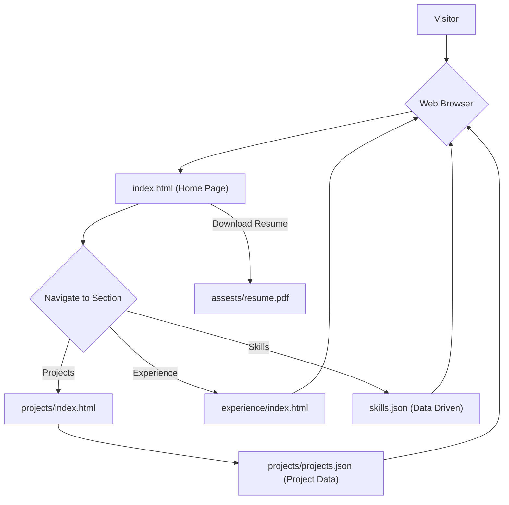

# 🚀 DynamicDev Portfolio

<p align="center"></p>

## Short Description
The **DynamicDev Portfolio** is a sleek, modern, and highly customizable personal portfolio website meticulously crafted to showcase your professional journey, skills, and projects in an engaging and interactive manner. Engineered for performance and aesthetics, it provides a compelling platform for developers, designers, and professionals to leave a lasting impression on recruiters, collaborators, and potential clients.

## ✨ Key Features
*   **Intuitive Navigation:** A well-structured layout with dedicated sections for Home, Experience, and Projects, ensuring a smooth user journey.
*   **Dynamic Content Management:** Skills and projects are managed via `skills.json` and `projects.json` files, allowing for easy updates without touching core HTML.
*   **Interactive Design:** Enhanced user experience with modern CSS styling, engaging JavaScript interactions, and animated elements powered by `particles.min.js`.
*   **Integrated Resume:** A direct download link for your professional resume (`assests/resume.pdf`), making it effortless for visitors to access your credentials.
*   **Automated Deployment:** Includes GitHub Actions CI/CD pipeline (`.github/workflows/ci-cd.yml`) for seamless and automated deployment of updates.
*   **Custom 404 Page:** A branded and user-friendly 404 error page (`404.html`) to guide users back to relevant content, enhancing overall site professionalism.
*   **Responsive & Performant:** Optimized for various devices with clean CSS and efficient JavaScript, featuring preloader animations (`assests/images/preloader.gif`) for a smooth loading experience.

## Who is this for?
This portfolio is ideal for:
*   **Software Developers & Engineers:** Showcase coding projects, technical skills, and professional experience.
*   **Web Designers:** Present design aesthetics and front-end development capabilities.
*   **Technical Professionals:** Create a professional online presence to attract job opportunities and networking connections.
*   **Students & Graduates:** Build an impressive digital resume to kickstart your career.

## Technology Stack & Architecture
This project is built as a static website, leveraging core web technologies for maximum performance and compatibility:

*   **Front-end:** HTML5, CSS3, JavaScript (Vanilla JS, `particles.min.js`)
*   **Data Storage:** JSON files (`skills.json`, `projects/projects.json`) for structured content.
*   **Development Tools:** VS Code integration (`.vscode/settings.json`)
*   **CI/CD:** GitHub Actions (`.github/workflows/ci-cd.yml`) for automated testing and deployment.

## 📊 Architecture & Database Schema



## ⚡ Quick Start Guide
To get your own DynamicDev Portfolio up and running:

1.  **Clone the Repository:**
    ```bash
    git clone https://github.com/242161088-cyber/portfolio_website.git
    cd portfolio_website
    ```
2.  **Open in Browser:**
    Simply open the `index.html` file in your preferred web browser to view the portfolio locally.
    ```bash
    # For Linux/macOS
    open index.html
    # For Windows
    start index.html
    ```
3.  **Customize Content:**
    *   Edit `skills.json` to update your technical skills.
    *   Modify `projects/projects.json` to showcase your projects.
    *   Update `assests/resume.pdf` with your latest resume.
    *   Adjust HTML and CSS files for further personalization.
4.  **Deploy (e.g., GitHub Pages):**
    This repository includes a `ci-cd.yml` workflow, typically used for automated deployment to platforms like GitHub Pages. Push your changes to the `main` branch, and the workflow will handle the deployment.

## 📜 License
This project is licensed under the MIT License. See the `LICENSE` file for more details.